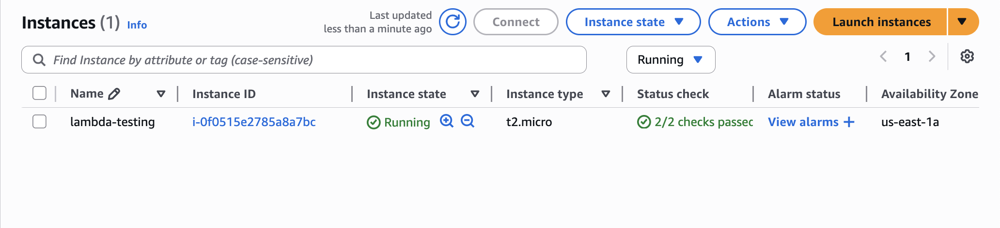
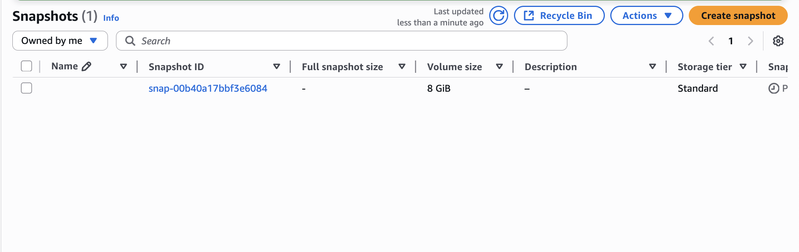
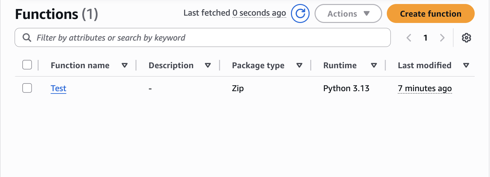
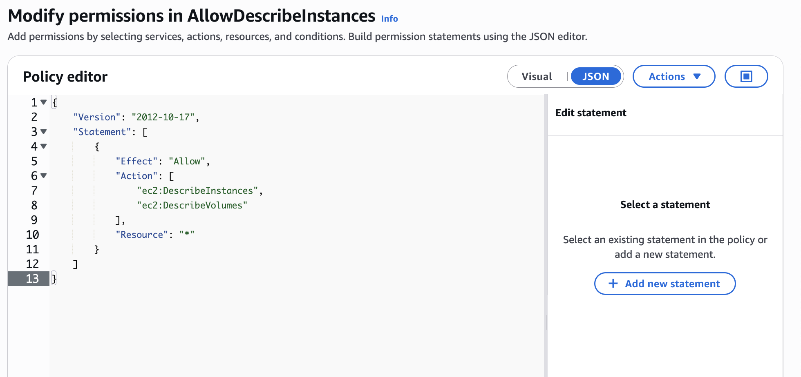
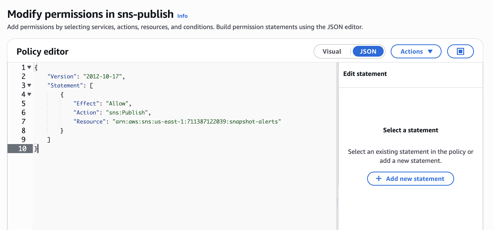
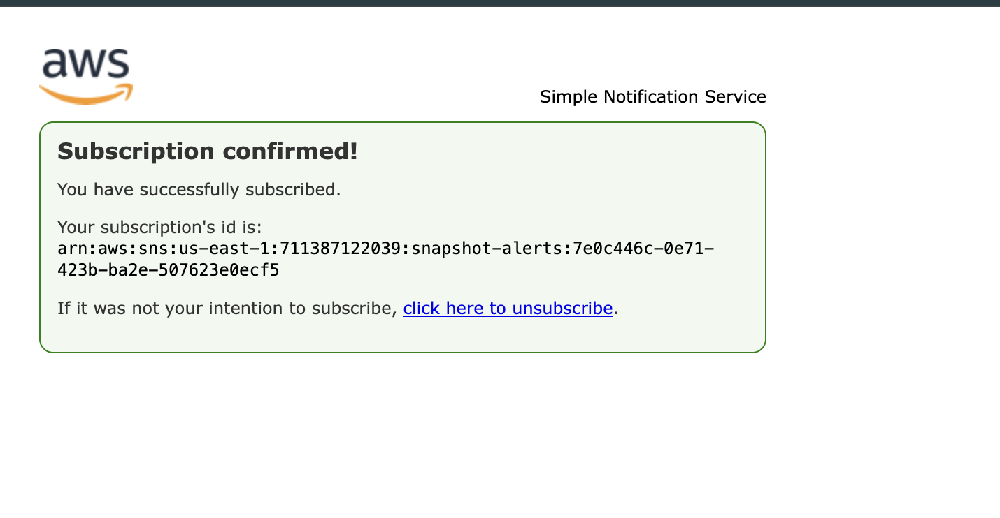
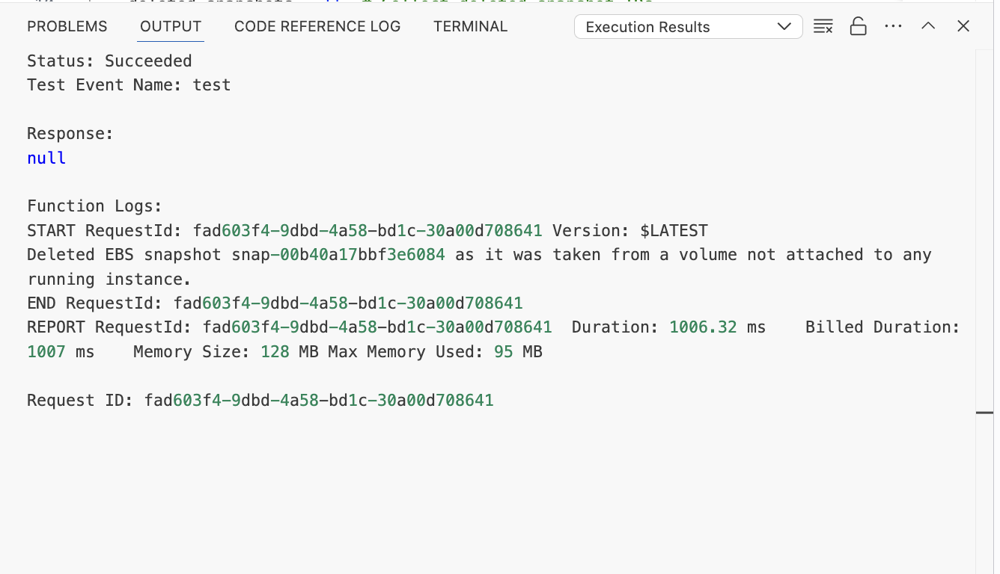
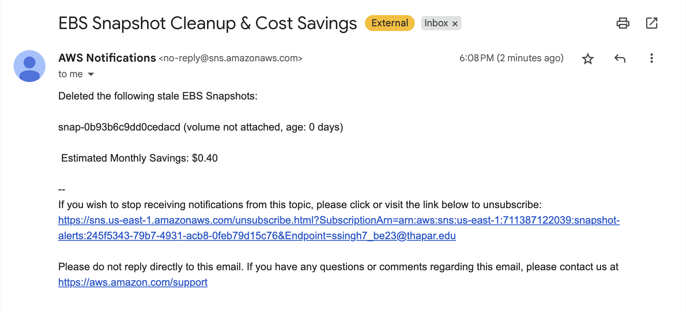

# 🚀 AWS EBS Snapshot Cleaner | Automated Cost Optimization with Lambda & SNS

This project uses an AWS Lambda function to automatically identify and delete stale EBS snapshots — including those from unattached, stopped, or deleted volumes. If a snapshot is older than 30 days or hasn’t been in use for 30 days, it qualifies for deletion. For testing purposes, the threshold is currently set to 0 days to allow immediate evaluation. The function also estimates monthly cost savings based on snapshot size and notifies users via Amazon SNS. It’s a fully serverless, cost-optimization solution aligned with modern cloud infrastructure and DevOps best practices.

---

## 🔍 Why This Matters

-  **Reduces AWS costs** by removing unused EBS snapshots that silently incur charges.
-  **Production-style architecture** with alerting and permission boundaries.
-  **Production-relevant tools**: AWS Lambda, IAM, EC2, SNS, boto3, infrastructure scripting.

---

## 🔧 Tech Stack

- **AWS Lambda** – Serverless function to automate cleanup  
- **Amazon EC2 & EBS** – Source of snapshots  
- **Amazon SNS** – Sends email alerts when snapshots are deleted  
- **IAM** – Access control via custom roles and policies  
- **Python (boto3)** – AWS SDK to interact with EC2, Volumes, and SNS

---

## ✅ Step-by-Step Deployment Guide

---

### 1. Launch an EC2 Instance & Snapshot

- Launch a test EC2 instance in any AWS region (e.g., `us-east-1`).
- Go to **EC2 → Snapshots → Select volume → Create Snapshot**.

📸 *Screenshot: EC2 instance*

📸 *Screenshot: Snapshot created*

---

### 2. Set Up the Lambda Function

- Go to **AWS Lambda → Create Function**.
- Set **runtime** to **Python 3.13** or later.
- Use the code from `lambda_function.py` in this repository.
- Under **Configuration → General**, set **timeout** to **10 seconds**.
- Deploy the function.

📸 *Screenshot: Lambda function created*

---

### 3. Set Up IAM Permissions

Attach the following permissions to your Lambda's execution role:

- `ec2:DescribeInstances`  
- `ec2:DescribeSnapshots`  
- `ec2:DescribeVolumes`  
- `ec2:DeleteSnapshot`  
- `sns:Publish`  

📸 *Screenshot: Custom IAM policy for ec2:DescribeInstances*

📸 *Screenshot: SNS Publish Permission*

---

### 4. Create an SNS Topic for Alerts

- Go to **Amazon SNS → Create Topic → Standard**.
- Name it something like `snapshot-alerts`.
- Add a **subscription method** (e.g., **Email**).
- Confirm the subscription via the email link.

📸 *Screenshot: Subscription Notification*

📸 *Screenshot: Subscription Confirmed*

---

### 5. First Test: No Deletion Expected

- Keep the EC2 instance **running**.
- Run the Lambda function from the **Test** tab.
- Expected: No snapshots should be deleted.

---

### 6. Second Test: Trigger Deletion

- **Terminate the EC2 instance**.
- Run Lambda again.
- It will detect stale snapshots and:
  -  **Delete** them
  -  **Send alert** via SNS to your email

📸 *Screenshot: Successful Lambda Test*

📸 *Screenshot: Email Notification*

---

### 🔒 IAM Summary

Permissions required for Lambda role:

- `ec2:DescribeInstances`  
- `ec2:DescribeSnapshots`  
- `ec2:DescribeVolumes`  
- `ec2:DeleteSnapshot`  
- `sns:Publish`

---

## 🧠 What You’ll Learn

- Automating snapshot cleanup workflows  
- Working with IAM and cross-service policies  
- Serverless scripting with Python and boto3  
- Integrating notifications via SNS  
- Implementing cloud cost optimization logic  

---

## 🧭 Next Steps
-  Implement tag-based retention filtering
-  Add security checks to avoid deleting tagged backups

---

## 🤝 Contributing

Feel free to fork this project, use it in production, or extend its functionality. If it helped you save on AWS billing — give it a ⭐ on GitHub!
